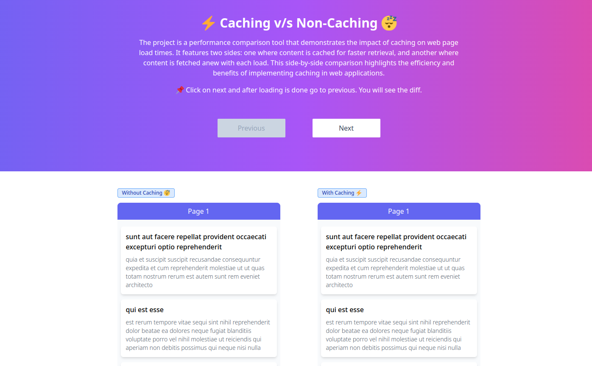

# ⚡ Caching v/s Non-Caching 😴

The project is a performance comparison tool that demonstrates the
impact of caching on web page load times. It features two sides: one
where content is cached for faster retrieval, and another where content
is fetched anew with each load. This side-by-side comparison highlights
the efficiency and benefits of implementing caching in web applications.

